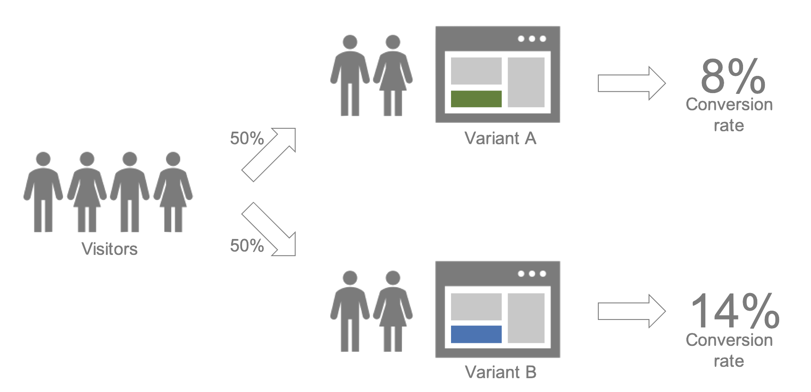

Welcome to prayas!
==================

*Prayas* is a Bayesian A/B Testing framework written in Python and
used within `Avira <http://avira.com>`_ to make business decisions
in many different areas.

Controlled experiments (A/B tests or randomized field experiments) are
the de facto standard to make data-driven decisions when implementing
changes and observing customer responses. Bayesian inference allows us
to express the results in easy to understand measures like *probability
to be the best variant* and *expected uplift in conversion rates*.

The *prayas* package currently implements three experiment scenarios that are
common in our company:

1. One option model -- A variant contains only one option to select
2. Multi-options model -- A variant can contain more than one option to select
3. Aggregated model -- Per variant only aggregated measures are observed

See :ref:`ref-examples` for an illustration of each model.
The underlying methodology is described in
`Bayesian A/B Testing for Business Decisions <https://arxiv.org/abs/2003.02769>`_
by Shafi Kamalbasha and Manuel J. A. Eugster (2020).

Contents
--------

.. toctree::
   :maxdepth: 2

   intro
   examples
   modules/index

Version
-------

Documentation based on `prayas` version |version|; generated on
|today|.

Feedback
--------

In case of any bug, comments, feature requests, etc. please open an issue on
the `project Github page <https://github.com/Avira/prayas>`_.

Contributors
------------

.. include:: ../CONTRIBUTORS

License
-------

`MIT <https://choosealicense.com/licenses/mit/>`_ License.
Copyright (c) 2019-2020 Avira Operations GmbH & Co. KG
